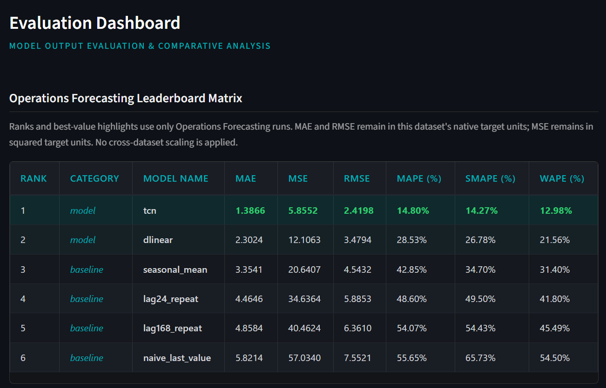

# Direct Multi-Horizon Time-Series Forecasting

Group 16 · Deep Learning Bonus Project · Summer Semester 2026

This repository implements two global neural forecasting models—**DLinear** and a
**Temporal Convolutional Network (TCN)**—for direct 336-hour forecasting from 168
hours of context. Both models are shared across all series, support known future
covariates, and predict the complete horizon in one pass without recursively
feeding predictions back into the model.

The codebase supports the provided operations benchmark and the public
*Electricity Load Diagrams* dataset through reproducible dataset manifests,
dataset-specific output folders, four classical baselines, local evaluation, and
an interactive dashboard.

## Highlights

- Direct multi-output DLinear and causal TCN implementations
- Reproducible import and preprocessing for two hourly datasets
- Leakage-safe known-future covariates and explicit feature ablations
- Naive, daily-repeat, weekly-repeat, and seasonal-mean baselines
- Chronological local holdouts with dataset-specific model selection
- Restart-safe experiment scripts and a dataset-isolated Streamlit dashboard
- Submission-compatible full-data retraining for the operations benchmark

## Results at a glance

| Evaluation | DLinear WAPE | TCN WAPE | Best baseline WAPE |
| --- | ---: | ---: | ---: |
| Operations public validation (full-data retraining) | 24.05% | **13.60%** | 34.41% · seasonal mean |
| Electricity local holdout (extended features) | 11.03% | **10.03%** | 11.05% · lag-168 repeat |

These rows use different datasets and evaluation protocols and therefore should
not be compared to each other. The dashboard likewise keeps their metrics and
rankings separate.

## Datasets and experiments

| Dataset | Series × hours | Available information | Experiments |
| --- | ---: | --- | --- |
| Operations Forecasting 2026 | 96 × 4,992 | Target history, supplied future covariates, and static series identity | Provided feature set |
| Electricity Load Diagrams | 320 × 26,304 | Target history and static series identity; no supplied future covariates | Raw, matched calendar, extended calendar |

The electricity importer reproduces the Hugging Face `lstnet` representation
from the original UCI archive: 15-minute loads are summed to hourly values, the
2012–2014 interval is retained, and clients inactive at the start of 2012 are
removed. The resulting hourly target values are not converted or rescaled.

The three electricity feature sets are cumulative:

1. **Raw** (`raw`): target history only, plus the model's series embedding.
2. **Matched** (`operations_calendar`): hour sine/cosine, weekday sine/cosine,
   weekend indicator, and deterministic linear trend—the timestamp features
   matching the operations dataset.
3. **Extended** (`calendar_extended`): all matched features plus day-of-year
   sine/cosine, month sine/cosine, Portuguese holidays, and a daylight-saving
   transition indicator.

All engineered covariates are deterministic functions of the forecast timestamp;
none uses future targets.

## Repository layout

```text
configs/
  datasets/                 Dataset manifests and feature-set definitions
  dlinear.yaml              Operations DLinear configuration
  tcn.yaml                  Operations TCN configuration
  electricity_*.yaml        Electricity model configurations
docs/
  how_to_train_and_submit.md
res/
  datasets/                 Reproducibly generated data (not versioned)
  figures/                  Architecture and dashboard figures
scripts/
  run_all_experiments.sh
  run_electricity_experiments.sh
  build_submission.sh        Validate and package the final operations TCN
src/
  datasets/                 Import, registry, feature engineering, and splitting
  model.py                  DLinear and TCN implementations
  predict.py                Reusable repository inference
  train.py                  Local and full-data training entry point
  run_baselines.py          Baseline generation and evaluation
  evaluate_predictions.py   Dataset-local metric computation
  dashboard.py              Streamlit evaluation dashboard
submission/                 Standalone, fixed-TCN private-evaluation package
tests/
  test_pipeline.py
```

Large datasets, checkpoints, predictions, and generated plots are intentionally
ignored. Resolved run configurations, training histories, and metrics remain
small enough to retain as reproducibility records.

## Setup

The documented workflow targets Linux or WSL, Python 3.11+, and
[`uv`](https://docs.astral.sh/uv/). From the repository root:

```bash
uv sync
```

`uv run` automatically uses the project environment; manual activation is not
required.

## Import the datasets

Each dataset is imported independently:

```bash
uv run python -m src.datasets.import_dataset operations
uv run python -m src.datasets.import_dataset electricity
```

Generated files are placed under
`res/datasets/<canonical-dataset-name>/{raw,processed}/`. Local chronological
splits are created automatically when baselines or training first run. See
[`res/datasets/README.md`](res/datasets/README.md) for the exact representation.

## One-command workflows

Run the complete suite—dependency sync, both imports, baselines, all local model
runs, operations full-data retraining, evaluation, and dashboard:

```bash
bash scripts/run_all_experiments.sh
```

If the electricity dataset and its baselines are already prepared, train only
the six electricity model ablations, refresh their metrics, and launch the
dashboard:

```bash
bash scripts/run_electricity_experiments.sh
```

Both scripts run sequentially. Prepared imports are reused, baselines are
regenerated, and complete neural runs are skipped. An incomplete neural-run
folder causes a safe stop instead of being overwritten. Stop the dashboard with
`Ctrl+C`.

## Manual training

The default 336-hour horizon comes from each dataset manifest, so
`--horizon 336` is optional.

### Baselines

```bash
uv run python src/run_baselines.py --dataset operations
uv run python src/run_baselines.py --dataset electricity
```

Each command evaluates `naive_last_value`, `lag24_repeat`, `lag168_repeat`, and
`seasonal_mean` on the selected dataset's local holdout.

### Operations models

```bash
uv run python src/train.py --config configs/dlinear.yaml
uv run python src/train.py --config configs/tcn.yaml
```

Operations runs optimize a differentiable scale-free proxy for the public
Overall score and select checkpoints on that same local proxy.

### Electricity ablations

```bash
uv run python src/train.py --config configs/electricity_dlinear.yaml feature_set=raw
uv run python src/train.py --config configs/electricity_tcn.yaml feature_set=raw

uv run python src/train.py --config configs/electricity_dlinear.yaml feature_set=operations_calendar
uv run python src/train.py --config configs/electricity_tcn.yaml feature_set=operations_calendar

uv run python src/train.py --config configs/electricity_dlinear.yaml feature_set=calendar_extended
uv run python src/train.py --config configs/electricity_tcn.yaml feature_set=calendar_extended
```

Electricity runs optimize and select on WAPE. This avoids using pointwise MAPE
as a training objective where legitimate zero loads occur. The stride is 12 hours
for operations and 96 hours for electricity; it remains fixed across models and
feature variants within each dataset.

Configuration values can be overridden without editing YAML. Use a unique run
name because existing output directories are never silently replaced:

```bash
uv run python src/train.py --config configs/tcn.yaml \
  run_name=tcn_large model.channels=96 max_epochs=300
```

## Evaluation and dashboard

Refresh metrics for one dataset at a time:

```bash
uv run python src/evaluate_predictions.py --dataset operations
uv run python src/evaluate_predictions.py --dataset electricity
```

The evaluator reads only local-holdout predictions beneath the selected dataset
folder. It deliberately ignores `*_full_training` public-validation exports,
whose hidden targets are unavailable locally.

Reported metrics are MAE, MSE, RMSE, MAPE, sMAPE, and WAPE. MAPE is computed only
where the actual target is non-zero; WAPE and sMAPE remain defined over the full
holdout. MAE and RMSE stay in each dataset's native units, and results are never
normalized or ranked across datasets.

Launch the dashboard with:

```bash
uv run streamlit run src/dashboard.py
```

The sidebar dataset selector keeps operations and electricity comparisons
separate. Within the chosen dataset, rows are ranked by the mean percentile rank
across the six reported metrics; this display rank is comparative and is not a
cross-dataset score.




## Output structure

```text
output/
  operations_forecasting_2026/
    baselines/horizon_336/
    dlinear/
    tcn/
    dlinear_full_training/
    tcn_full_training/
  electricity_load_diagrams/
    baselines/horizon_336/
    raw/{dlinear,tcn}/
    operations_calendar/{dlinear,tcn}/
    calendar_extended/{dlinear,tcn}/
```

Local neural runs contain `config.yaml`, `checkpoint.pt`, `history.csv`,
`predictions.csv`, and `metrics.json`. Baseline folders contain one prediction
CSV and one metrics JSON per method.

## Operations full-data retraining and submission

After local model selection, retrain the exact configuration on all available
operations targets for the selected number of epochs:

```bash
uv run python src/train.py --full-training-from output/operations_forecasting_2026/dlinear
uv run python src/train.py --full-training-from output/operations_forecasting_2026/tcn
```

These commands create sibling `*_full_training` folders and write
`dlinear_validation.csv` or `tcn_validation.csv` for public evaluation. They do
not modify `submission/` automatically.

The repository runtime is fully contained in the root `src/` package; training,
local evaluation, the dashboard, and full-data retraining never import from
`submission/`. That folder is an intentionally separate deployment copy of the
selected operations TCN, with fixed architecture and inference settings.

Build and validate the final archive with:

```bash
bash scripts/build_submission.sh
```

The builder copies only the final TCN checkpoint, runs the standalone entry point
on the public validation inputs, and creates `submission/final_submission.zip`.
Its archive root contains exactly `predict.py`, `requirements.txt`,
`checkpoint.pt`, and `src/`. Detailed instructions and the private evaluator
contract are in
[`docs/how_to_train_and_submit.md`](docs/how_to_train_and_submit.md).

## Tests

```bash
uv run python -m unittest tests/test_pipeline.py
```

The tests cover metric definitions, zero-target MAPE handling, feature-set
leakage safety, window construction, model output shapes, and direct repository
inference. The submission builder separately smoke-tests the standalone archive
entry point.
